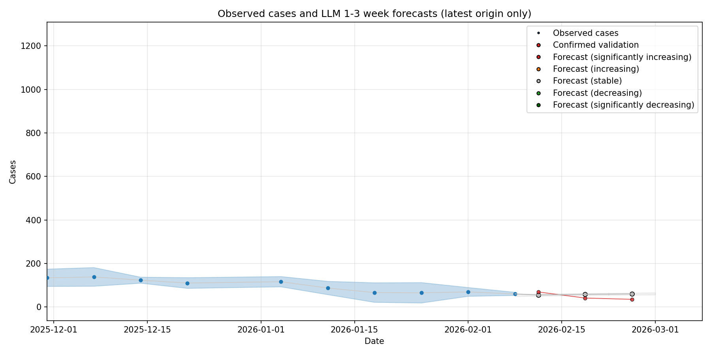
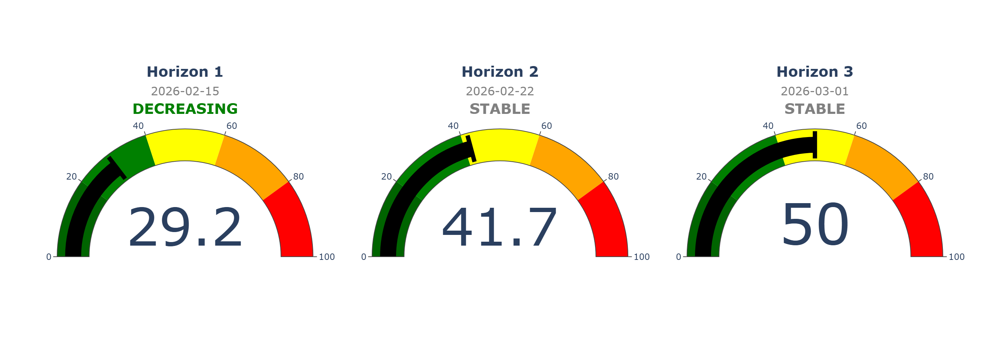

# Methods for using LLMs for pandemic preparedness modeling

Pipeline to pull recent COVID-19 data from RIVM, process it, incorporate it into an LLM prediction, and validate results. Currently only set up for COVID-19, but hopefully adding more use cases in the future.
______

## Quarto reporting

This repo now includes a Quarto reporting scaffold that reads existing artifacts from `results/` and does not rerun the forecasting pipeline during render.

Current pages:

- `index.qmd`
- `dashboards/covid.qmd`

To render locally once Quarto is installed:

```powershell
quarto render
```

Design intent:

- Keep forecasting and data prep in the existing Python/R pipeline.
- Keep Quarto as a reporting layer over stable CSV/JSON outputs.
- Add future dashboards as new `.qmd` pages under `dashboards/` or `reports/`.


Forecast plot:



Risk gauge plot




